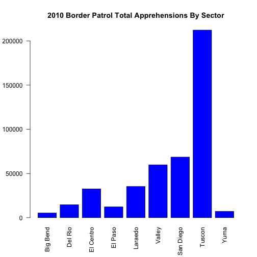
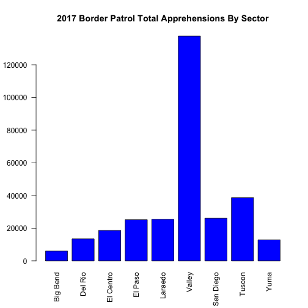

CNN: Border Apprehensions Statistics Project
========================================================
author: Alyssa Lai & Chen Hong
date: February 19, 2018
autosize: true

Data
========================================================

The data comes from CNN coverage of apprehensions at the US-Mexico border.
Our data consists of:

- 2010 Apprehensions By Sector
- 2017 Apprehensions By Sector
- Total Apprehensions From 2000-2017

Apprehensions from 2000-2017
========================================================

- Shows total apprehensions at the Mexican Border between the years of 2000 and 2017
- Steady upwards trend over the years

***


2010 Apprehensions By Sector
========================================================

- Shows total number of apprehensions at the Mexican border in 2010, divided by Sector

***



2017 Apprehensions By Sector
========================================================

- Shows total number of apprehensions at the Mexican border in 2017, divided by Sector

***



Paired T-Test
========================================================


```

	Paired t-test

data:  rowSums(DMA2010, na.rm = T) and rowSums(DMA2017, na.rm = T)
t = 0.71295, df = 8, p-value = 0.4961
alternative hypothesis: true difference in means is not equal to 0
95 percent confidence interval:
 -35705.54  67664.43
sample estimates:
mean of the differences 
               15979.44 
```

Paired T-Test
========================================================

Is there a significant difference between the number of apprehensions at the border in 2010 than in 2017?

- Paired number of apprehensions based on Sector
- Null Hypothesis = the difference in the number of apprehensions in 2010 and 2017 is equal to 0
- Alternate Hypothesis = the difference in the number of apprehensions in 2010 and 2017 is not equal to 0
- P-Value = 0.4961, meaning that there is no significant difference and that alternate hypothesis will be rejected
- Thus, <strong>the number of apprehensions in 2010 and 2017 are not significantly different</strong>


