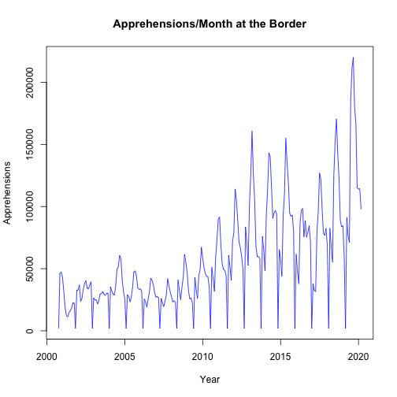
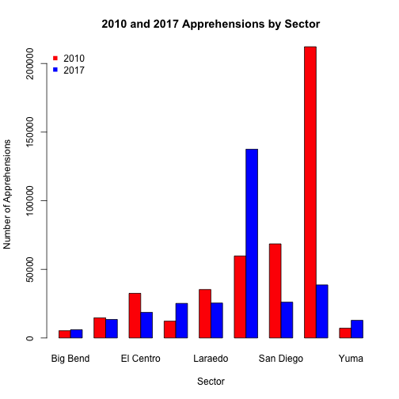

CNN: Border Apprehensions
========================================================
author: Alyssa Lai & Chen Hong
date: February 19, 2018
autosize: true

Data
========================================================

The data comes from CNN coverage of apprehensions at the US-Mexico border.
Our data consists of:

- 2010 Apprehensions By Sector
- 2017 Apprehensions By Sector
- Total Apprehensions From 2000-2017

Apprehensions from 2000-2017
========================================================
<br>
<br>
<br>
- Shows total apprehensions at the Mexican Border between the years of 2000 and 2017
- Upwards trend over the years

***



2010 Apprehensions By Sector
========================================================
<br>
<br>
<br>
- Shows total number of apprehensions at the Mexican border in 2010, divided by Sector

***


2017 Apprehensions By Sector
========================================================
<br>
<br>
<br>
- Shows total number of apprehensions at the Mexican border in 2017, divided by Sector

***


2010 and 2017 Comparison
========================================================

<br>
<br>
- Shows difference between the number of apprehensions in 2010 and 2017 at the different sectors
- Tuscon had most apprehensions in 2010
- Rio Grande Valley had more apprehenstions in 2017

***



Tuscon T-Test
========================================================


```

	Welch Two Sample t-test

data:  DMA2017[8, ] and DMA2010[8, ]
t = -6.4303, df = 11.781, p-value = 3.545e-05
alternative hypothesis: true difference in means is not equal to 0
95 percent confidence interval:
 -19372.450  -9551.716
sample estimates:
mean of x mean of y 
 3221.417 17683.500 
```

Tuscon T-Test Results
========================================================

Is there a significant difference between the number of apprehensions at the Tuscon Sector in 2010 than in 2017?

- Null Hypothesis = the difference in the number of apprehensions at Tuscon in 2010 and 2017 is equal to 0
- Alternate Hypothesis = the difference in the number of apprehensions at Tuscon in 2010 and 2017 is not equal to 0
- P-Value = .00003545, meaning that there is a significant difference and that the null hypothesis will be rejected
- Thus, <strong>the number of apprehensions at Tuscon in 2010 and 2017 are significantly different</strong>


Rio Grande Valley T-Test
========================================================


```

	Welch Two Sample t-test

data:  DMA2017[6, ] and DMA2010[6, ]
t = 2.7789, df = 11.846, p-value = 0.01686
alternative hypothesis: true difference in means is not equal to 0
95 percent confidence interval:
  1392.65 11573.35
sample estimates:
mean of x mean of y 
  11463.5    4980.5 
```

Rio Grande Valley T-Test Results
========================================================

Is there a significant difference between the number of apprehensions at the Rio Grande Valley Sector in 2010 than in 2017?

- Unpaired t-test
- Null Hypothesis = the difference in the number of apprehensions at the Rio Grande Valley in 2010 and 2017 is equal to 0
- Alternate Hypothesis = the difference in the number of apprehensions at the Rio Grande Valley in 2010 and 2017 is not equal to 0
- P-Value = 0.01686, meaning that there is a significant difference and that the null hypothesis will be rejected
- Thus, <strong>the number of apprehensions at the Rio Grande Valley in 2010 and 2017 are significantly different</strong>

Overall Paired T-Test
========================================================


```

	Paired t-test

data:  rowSums(DMA2010, na.rm = T) and rowSums(DMA2017, na.rm = T)
t = 0.71295, df = 8, p-value = 0.4961
alternative hypothesis: true difference in means is not equal to 0
95 percent confidence interval:
 -35705.54  67664.43
sample estimates:
mean of the differences 
               15979.44 
```

Overall T-Test Results
========================================================

Is there a significant difference between the total number of apprehensions at the border in 2010 than in 2017?

- Paired number of apprehensions based on Sector
- Null Hypothesis = the difference in the number of apprehensions in 2010 and 2017 is equal to 0
- Alternate Hypothesis = the difference in the number of apprehensions in 2010 and 2017 is not equal to 0
- P-Value = 0.4961, meaning that there is no significant difference and that null hypothesis will not be rejected
- Thus, <strong>the number of apprehensions in 2010 and 2017 are not significantly different</strong>


